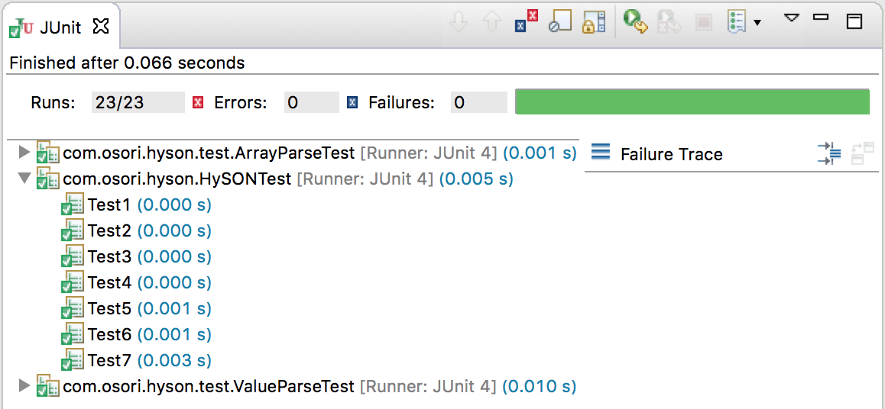

# hySON-Java
## 목표
* JSON은 서버와 통신할 때 가장 많이 사용하는 포맷이다. 사용시 매번 귀찮은 파싱과정을 거쳐야 한다. 대안인 gSON은 Generic Type을 지원하지 않는다. JSON을 Class instance로 쉽게 생성하는 것이 hySON의 목표이다.

## 사용법
* JSON의 key값과 동일 field명을 갖는 class를 작성한다.
* HySON.parse(jsogString, 맵핑될클래스.class) 메소드를 호출하면 끝!
* 아래와 같이 간단한 코드로 쉽게 JSON을 파싱할 수 있다.

```java
String jsonString = "{\"a\": 10, \"b\" : \"횟횟\", \"c\" : [2, 3, 4], \"d\": [5, 6], \"temps\":[{\"value\": 20}]}";

Test7Class test7Class = HySON.parse(jsonString, Test7Class.class);
```

* 이렇게 복잡한 필드가 JSON 데이터에 맞게 채워진다!

```java
public class Test1Class
{
	public int value;
}

public class Test7Class
{
	public int a;
	public String b;
	@Member(Integer.class)
	public ArrayList<Integer> c;
	public int[] d;
	@Member(Test1Class.class)
	public ArrayList<Test1Class> temps;
}
```

## 테스트

* Primitive Type, Object Type, ArrayList, 복잡한 필드를 가진 객체 등이 테스트 되었다.




## 남은 작업
* ~~Inner class는 생성되지 않음(Outer class의 instance 필요)~~
* Generic Type은 ArrayList만 지원(List, HashMap 등 지원 예정)
* "key":3.0 을 int field에 저장하면 에러, 타입 변환 기능

## License
```
The MIT License (MIT)

Copyright (c) 2016 Hanyang Osori

Permission is hereby granted, free of charge, to any person obtaining a copy
of this software and associated documentation files (the "Software"), to deal
in the Software without restriction, including without limitation the rights
to use, copy, modify, merge, publish, distribute, sublicense, and/or sell
copies of the Software, and to permit persons to whom the Software is
furnished to do so, subject to the following conditions:

The above copyright notice and this permission notice shall be included in all
copies or substantial portions of the Software.

THE SOFTWARE IS PROVIDED "AS IS", WITHOUT WARRANTY OF ANY KIND, EXPRESS OR
IMPLIED, INCLUDING BUT NOT LIMITED TO THE WARRANTIES OF MERCHANTABILITY,
FITNESS FOR A PARTICULAR PURPOSE AND NONINFRINGEMENT. IN NO EVENT SHALL THE
AUTHORS OR COPYRIGHT HOLDERS BE LIABLE FOR ANY CLAIM, DAMAGES OR OTHER
LIABILITY, WHETHER IN AN ACTION OF CONTRACT, TORT OR OTHERWISE, ARISING FROM,
OUT OF OR IN CONNECTION WITH THE SOFTWARE OR THE USE OR OTHER DEALINGS IN THE
SOFTWARE.
```
